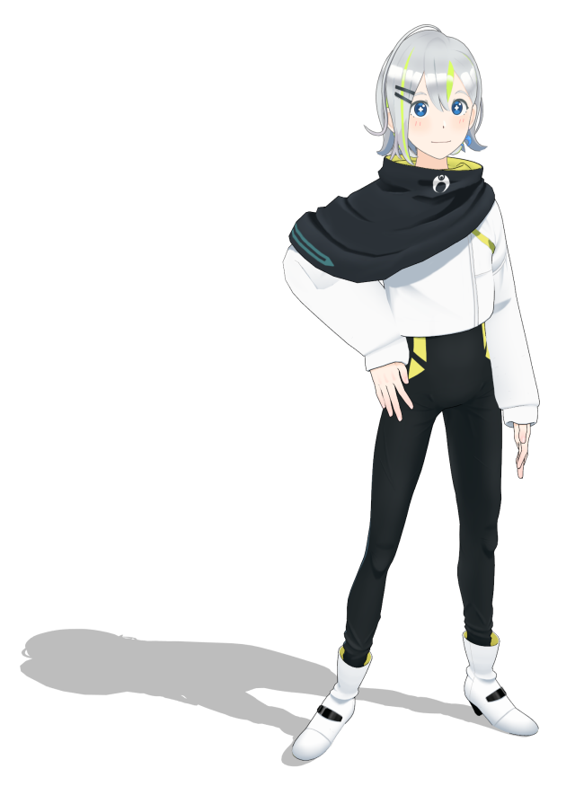
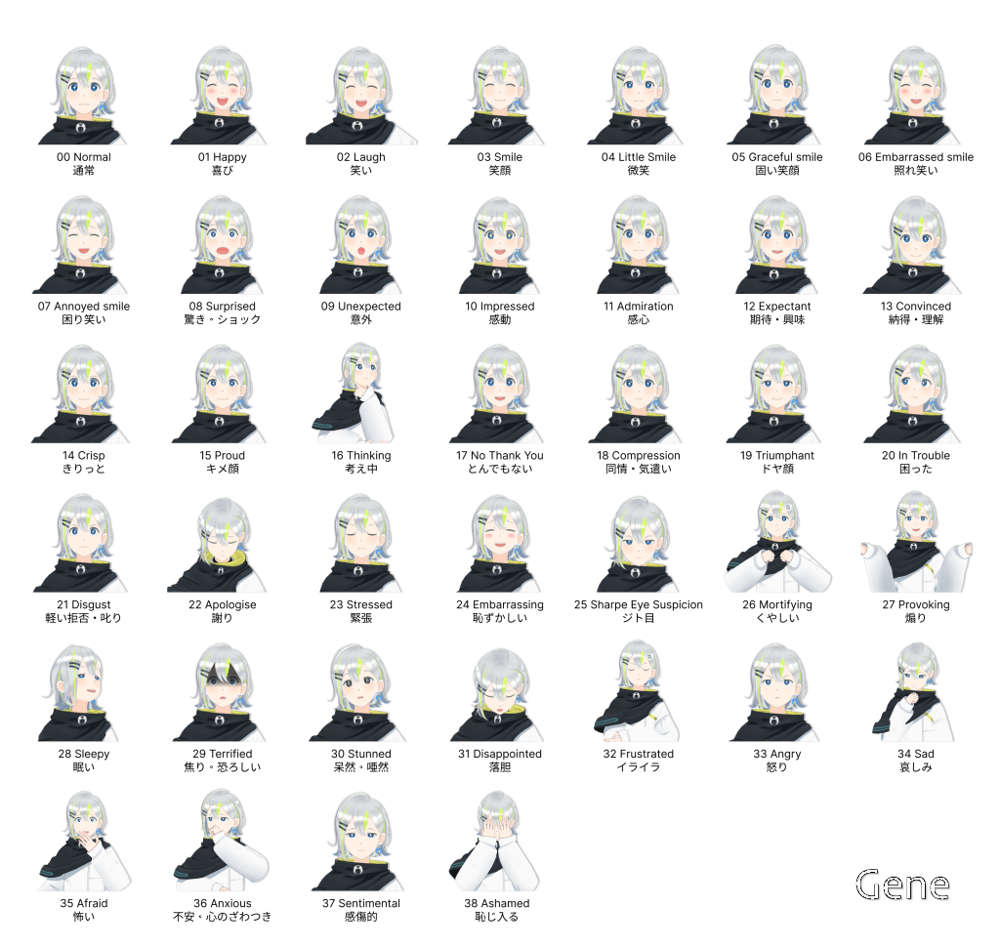

# CG アバター 「ジェネ」

[](README.md)
[](README.ja.md)



「ジェネ / Gene」は、対話システムやアバターコミュニケーションのために作られた CG-CA (Cybernetic Agent) キャラクターモデルです。このMMDモデルはCC-BY 4.0 ライセンスのもと、自由に利用・編集等が行えます。（利用条件については下記のライセンスの節をお読みください）

このCGアバターは、[ムーンショット型研究開発「アバター共生社会」プロジェクト](https://avatar-ss.org/)において、[MMDAgent-EX](https://mmdagent-ex.dev/) を用いた音声対話・アバターシステムのリファレンスモデルとして設計・開発されたものです。

## 表現力

このモデルは100以上のモーフを備えており、多様な会話上のアクションを実装可能です。以下は代表的な表情の例です。これらの表情・リアクションを行うモーションファイルが `motion` フォルダ内に収められており、利用できます。



## モデルスペック

- 28646 頂点, 47106 面, 13材質, 12 テクスチャ
- A ポーズ、MMD互換スケール
- 224 ボーン（MMD準標準ボーン対応）
- 184 モーフ（MMD互換+パーフェクトシンク）
- 物理演算：87剛体, 92ジョイント

## 主要なファイル

このレポジトリには2つの MMD 形式のモデル（通常、および軽量版(light)）、MMDAgent-EX 用の設定ファイル、およびサンプルの対話用モーションが含まれています。

```text
   Gene.pmd                モデルファイル (.pmd)
   Gene.pmd.csv            モデル拡張定義ファイル
   Gene.pmd.shapemap       リップシンク定義ファイル for MMDAgent-EX
   Gene.pmd.loadmessage    ロード時自動実行メッセージ定義 for MMDAgent-EX
   Gene.pmd.deletemessage  削除時自動実行メッセージ定義 for MMDAgent-EX
   Gene.pmx                モデルファイル (.pmx)
   tex/                    モデル用テクスチャファイル
   Gene_light.*            軽量版モデル
   light/                  軽量版テクスチャ
   motion/                 対話リアクションサンプルモーション
```

## 利用方法

MMDAgent-EX で `Gene.pmd` を `MODEL_ADD` 等で指定して使ってください。

MMD のツール等でで読み込む場合は `Gene.pmx` のほうを使ってください。

動作が重い場合は軽量版 `Gene_light.pmd` のほうを使ってください。テクスチャの解像度が下がるので表示は多少荒くなりますが、軽快に動作します。なお機能は同一です。

MMDAgent-EX で使う際のチュートリアル等の詳しい説明は[MMDAgent-EXのサイト](https://mmdagent-ex.dev/)をご覧ください。

## 特別なモーフ

頭部の装飾をそれぞれモーフ操作で消すことができます。

- 髪のメッシュ
- 髪留め
- 頬の赤み表現（斜線と赤み）

下記のモーフを設定してください。

- "`頬斜線消し`"  1にすると頬の斜線が消える
- "`頬赤み消し`"  1にすると頬の赤みが消える
- "`頬全消し`" 1 で斜線と赤みの両方が消える
- "`メッシュなし`" 1 で髪のメッシュが消える
- "`髪留なし`" 1 で髪留めが消える

モーション等で上記モーフ値を指定するほか、MMDAgent-EX の以下のメッセージでもモーフ値を直接設定できます。

```text
MODEL_BINDFACE|モデルエイリアス名|モーフ名|値
```

## ライセンス

本レポジトリに含まれるファイルは全て [CC-BY 4.0 ライセンス](https://creativecommons.org/licenses/by/4.0/deed.ja)で公開されています。利用の際は以下のクレジット表記を用いてください。

```text
CG-CA Gene (c) 2023 by Nagoya Institute of Technology, Moonshot R&D Goal 1 Avatar Symbiotic Society
```

なお、**名古屋工業大学はこのモデルに関する商標権および意匠権を保持しています**。以下の場合は許諾なしに利用いただいて問題ありません。

- 学術活動（論文掲載、発表等）
- 個人の方の非営利的な利用（SNSへの投稿、イベントでの掲示等）

上記以外の営利活動・商用利用、その他での利用については、個別に 李 (ri@nitech.ac.jp) までお問い合わせください。

## 利用ガイドライン

本レポジトリに含まれるファイルの利用および二次創作に対するガイドラインを以下のとおり定めます。なお、本ガイドラインは時代や技術の進展、法的要件の変更に応じて更新されることがあります。

してはいけない使い方：

- 児童性的虐待となる素材、または児童を搾取したり傷つけたりするコンテンツの再生
- 憎悪（ヘイト）、ハラスメント、暴⼒を助長するコンテンツの作成
- 物理的な危害を及ぼす危険性の⾼い活動。以下を含む：
  - 武器の製造
  - 軍事・紛争
  - エネルギー・交通・水等の重要施設の管理やオペレーション
  - 自殺・傷つけ・摂食障害などの自傷行為を促進、奨励、または描写するコンテンツ
- 詐欺的あるいは欺瞞的な⾏為。以下を含む：
  - 詐欺
  - 組織的な不正行為
  - 盗作
  - 偽情報の拡散
  - 他者を欺く目的で、実在の人物、団体、組織になりすましたり、虚偽の表現をする行為
- MikuMikuDance (MMD) の関連コミュニティおよびそこにある有形無形の価値を害する行為。以下を含む：
  - モデル・モーション・音楽等の権利者の権利を損なう行為
  - 権利者が定めるガイドラインに従わない利用
  - 不当な二次配布・盗用・作者なりすまし

なお、二次創作を原因とする利用者間のトラブルについて、公式は一切責任を負いません。自己責任でお願いします。

## リンク

- [名工大 李 研究室](https://www.slp.nitech.ac.jp/)
- [石黒プロジェクト ムーンショット型研究開発事業 アバター共生社会](https://avatar-ss.org/)

## リンク

- [オフィシャルサイト](https://mmdagent-ex.dev/)
- Twitter/X: [@MMDAgentEX](https://twitter.com/MMDAgentEX)
- 関連レポジトリ：
  - [MMDAgent-EX](https://github.com/mmdagent-ex/MMDAgent-EX)
  - [CG-CA "Uka"](https://github.com/mmdagent-ex/uka)

## 連絡先

E-mail: mmdagent-ex-official@lee-lab.org

開発チーム: [名古屋工業大学 李 研究室](https://www.slp.nitech.ac.jp/)

---
<p xmlns:cc="http://creativecommons.org/ns#" xmlns:dct="http://purl.org/dc/terms/"><a property="dct:title" rel="cc:attributionURL" href="https://github.com/mmdagent-ex/gene">CG-CA Gene</a> by <span property="cc:attributionName">Nagoya Institute of Technology and Moonshot R&D Goal 1 Avatar Symbiotic Society</span> is licensed under <a href="http://creativecommons.org/licenses/by/4.0/?ref=chooser-v1" target="_blank" rel="license noopener noreferrer" style="display:inline-block;">CC BY 4.0</a></p>
