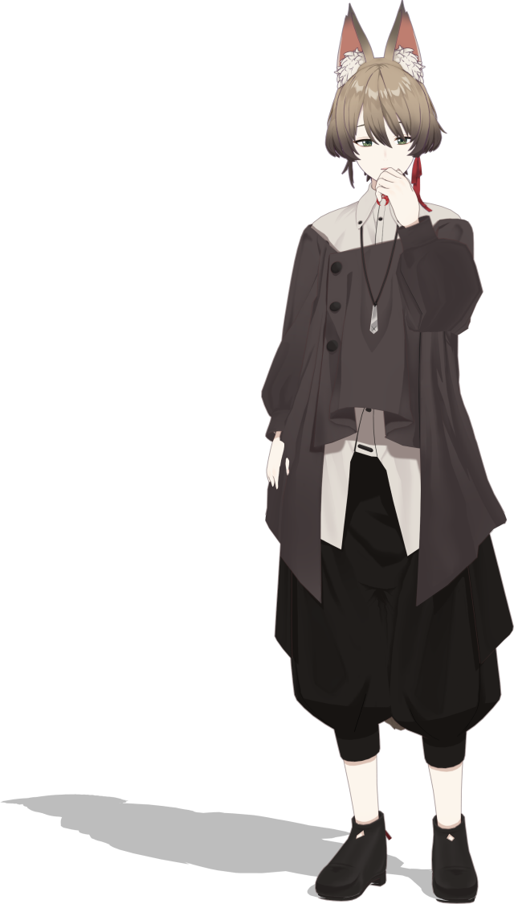
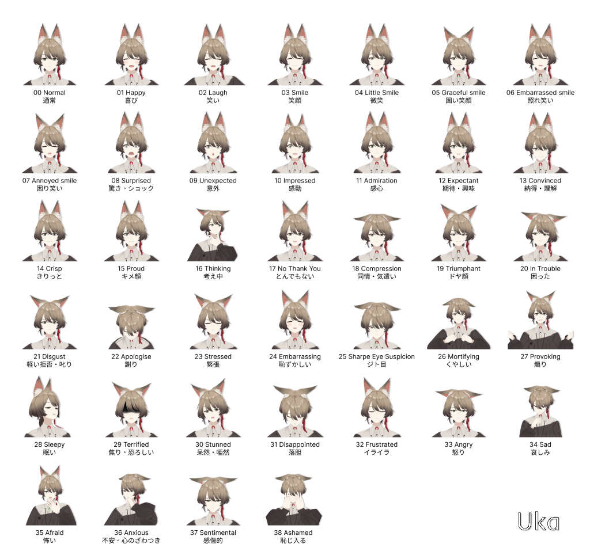

# CG Cybernetic Avatar "Uka"

[](README.md)
[](README.ja.md)



"Uka" is a CG-CA (cybernetic avatar) character model for spoken dialogue systems and avatar communication.  You can open/edit/modify this MMD model under CC-BY 4.0 license.

This CG avatar has been created under [AVATAR SYMBIOTIC SOCIETY Project](https://avatar-ss.org/en/index.html) as an avatar model for [MMDAgent-EX](https://mmdagent-ex.dev/) toolkit.

## Expressions

This model equips +100 morphs for facial expression so that it can express various conversational actions.  Here is an example of pre-defined expressions that can be played by the motion files under `motion` directory.



## Model Specifications

- 49951 vertices, 77907 surfaces, 10 materials, 8 textures
- A-pose, MMD-compliant scale
- 301 bones (supports MMD semi-standard bones)
- 148 morphs (basic MMD-compliant faces + perfect sync support)
- Physics: 164 rigid bodies, 151 joints

## Files

This repository contains MMD models, configuration files for use in MMDAgent-EX, and sample motion files for dialog system.

```text
   MS_Uka.pmd           Model file (.pmd)
   MS_Uka.pmd.csv       Model extended file
   MS_Uka.pmd.shapemap  Lipsync definitions for MMDAgent-EX
   MS_Uka.pmx           Model file (.pmx)
   tex/                 Texture images for the model
   motion/              Sample dialog motions
```

## Usage

To load model in MMDAgent-EX, just specify the model file "`Uka.pmd`" at `MODEL_ADD` message or other messages.

To use this model on MMD tools, use "`Uka.pmx`" and convert it to be used with MMDAgent-EX.

See [Official site](https://mmdagent-ex.dev/) for more documentations.

## License

Files in this repository are licensed by Nagoya Institute of Technology under [CC-BY 4.0](https://creativecommons.org/licenses/by/4.0/deed.en).  For use, please use this credit:

```text
CG-CA Uka (c) 2023 by Nagoya Institute of Technology, Moonshot R&D Goal 1 Avatar Symbiotic Society
```

## Usage Guideline

These guidelines outline the ethical, legal and social issues to be observed when using this model.

Disallowed usage of our model:

- Child Sexual Abuse Material or any content that exploits or harms children
- Promotion of hateful, harassing, or violent content
- Activity that has high risk of physical harm, including:
  - Weapons development
  - Military and warfare
  - Management or operation of critical infrastructure in energy, transportation, and water
  - Content that promotes, encourages, or depicts acts of self-harm, such as suicide, cutting, and eating disorders
- Fraudulent or deceptive activity, including:
  - Scams
  - Coordinated inauthentic behavior
  - Plagiarism
  - Disinformation
  - Impersonation or misrepresentation of an actual person, group, or organization for the purpose of deceiving others
- Actions harmful to the MikuMikuDance related community and its fun society:
  - Creation and disribution of contents that violates the rights of copyright holders of models, motions, music, etc.
  - Ignoring guidelines set by the copyright holders.
  - Unauthorized redistribution, plagiarism, and impersonation of the original creators.

Disclaimer: we are not responsible for any troubles between users caused by derivative works. Please take responsibility for your actions.

## Links

- [Official Site](https://mmdagent-ex.dev/)
- Twitter/X: [@MMDAgentEX](https://twitter.com/MMDAgentEX)
- Repositories:
  - [MMDAgent-EX](https://github.com/mmdagent-ex/MMDAgent-EX)
  - [CG-CA "Gene"](https://github.com/mmdagent-ex/gene)

## Contact

E-mail: mmdagent-ex-official@lee-lab.org

Dev Team: [Lee-Lab, Nitech](https://www.slp.nitech.ac.jp/en/)

---
<p xmlns:cc="http://creativecommons.org/ns#" xmlns:dct="http://purl.org/dc/terms/"><a property="dct:title" rel="cc:attributionURL" href="https://github.com/mmdagent-ex/uka">CG-CA Uka</a> by <span property="cc:attributionName">Nagoya Institute of Technology and Moonshot R&D Goal 1 Avatar Symbiotic Society</span> is licensed under <a href="http://creativecommons.org/licenses/by/4.0/?ref=chooser-v1" target="_blank" rel="license noopener noreferrer" style="display:inline-block;">CC BY 4.0</a></p>